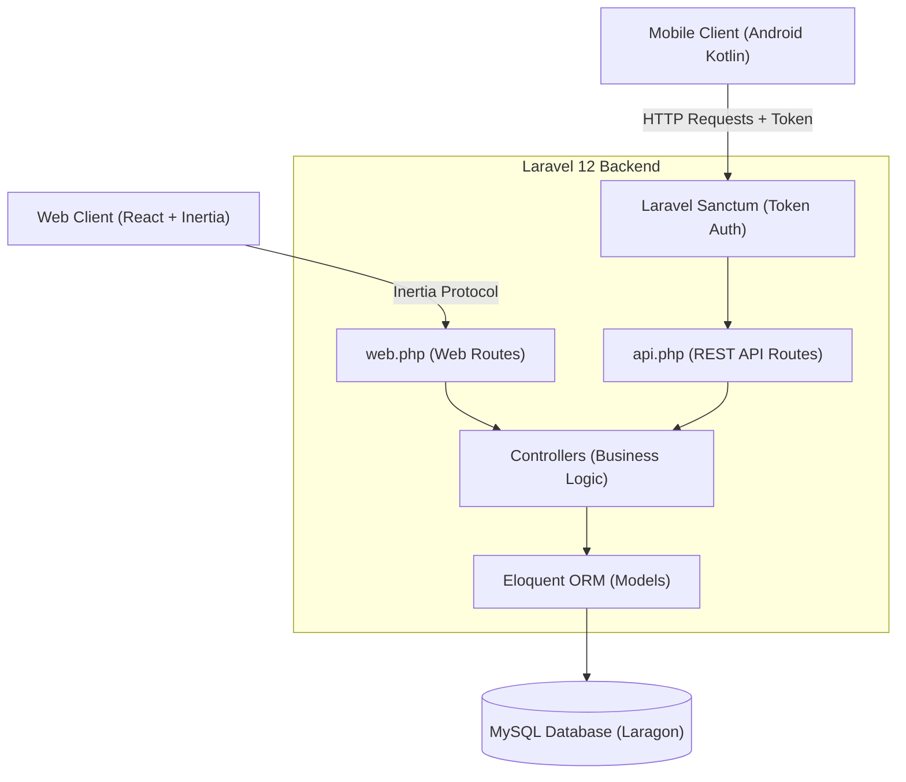
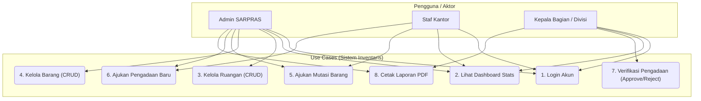
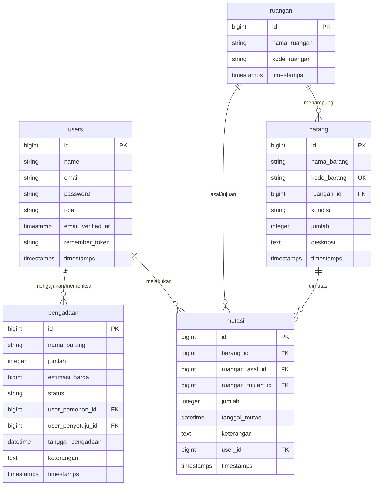

# Blueprint & Roadmap - Sistem Informasi Inventaris Kantor

Blueprint ini mendefinisikan arsitektur sistem, peran pengguna, spesifikasi antarmuka API, serta peta jalan (roadmap) langkah-demi-langkah pembangunan aplikasi **Inventaris Kantor** (Laravel 12 + React Inertia + REST API untuk Android Kotlin).

---

## 1. Arsitektur Sistem

Aplikasi ini menggunakan pendekatan hybrid:
- **Web Client (React.js + Inertia.js)**: Menyatu dalam repositori Laravel. Inertia menjembatani Controller Laravel langsung ke komponen React tanpa menulis REST API terpisah untuk web.
- **Mobile Client (Android Kotlin)**: Berdiri terpisah. Berkomunikasi dengan backend melalui **REST API JSON** (`routes/api.php`) dengan autentikasi berbasis token (**Laravel Sanctum**).
- **Database (MySQL)**: Satu database tunggal yang diakses bersama oleh web dan mobile.

---

## 2. Desain Sistem (Use Case & ERD)

### A. Use Case Diagram
Diagram ini menjelaskan aktor dan cakupan fungsional sistem inventaris:

### B. Entity-Relationship Diagram (ERD)
Hubungan antar tabel dalam database `db_inventaris_kantor`:

---

## 3. Hak Akses & Matriks Peran (Role Matrix)

Sistem ini memiliki **3 peran utama** dengan batas otorisasi sebagai berikut:

| Fitur | Staf | Admin / Staf SARPRAS | Kepala Bagian |
| :--- | :---: | :---: | :---: |
| **Melihat Dashboard & Laporan** | Ya | Ya | Ya |
| **Mengelola Master Data (Barang, Ruangan)** | Tidak | **Ya (CRUD)** | Tidak |
| **Mengajukan Pengadaan Barang** | **Ya** | Ya | Tidak |
| **Menyetujui/Menolak Pengadaan** | Tidak | Tidak | **Ya (Approve/Reject)** |
| **Mengajukan Mutasi Barang** | **Ya** | Ya | Tidak |
| **Mengeksekusi Mutasi Barang** | Tidak | **Ya (Update Stok & Ruangan)** | Tidak |
| **Cetak/Export Laporan PDF** | Tidak | Ya | **Ya** |

---

## 4. Peta Jalan Pembangunan (Step-by-Step Roadmap)

### **Fase 1: Setup Lingkungan & Skema Database** (Selesai ✅)
- [x] Inisialisasi Laravel 12 + React (Inertia.js) + Tailwind CSS.
- [x] Konfigurasi `.env` ke database MySQL Laragon.
- [x] Membuat berkas migrasi tunggal `create_all_tables` untuk seluruh tabel.
- [x] Menyiapkan model (`Ruangan`, `Barang`, `Mutasi`, `Pengadaan`, `User`).
- [x] Menyiapkan `DatabaseSeeder` dengan 3 akun role default dan data awal.

### **Fase 2: Pembuatan API Backend (REST API untuk Kotlin)** (Selesai ✅)
- [x] **API Autentikasi** (`POST /api/login`, `POST /api/logout`).
- [x] **API Master Data** (`GET /api/barang`, `GET /api/ruangan`).
- [x] **API Transaksi Mutasi** (`POST /api/mutasi`).
- [x] **API Transaksi Pengadaan** (`GET /api/pengadaan`, `POST /api/pengadaan`).

### **Fase 3: Pembuatan Logika Bisnis & Controller Web (Inertia)** (Selesai ✅)
- [x] **RuanganController**: CRUD ruangan.
- [x] **BarangController**: CRUD barang beserta pencariannya.
- [x] **MutasiController**: Pengajuan mutasi & eksekusi mutasi (DB Transactions).
- [x] **PengadaanController**: Pengajuan pengadaan (Staf) & persetujuan (Kepala Bagian).
- [x] **LaporanController**: Mengolah rekap data barang dan mutasi siap cetak.

### **Fase 4: Pembangunan UI Web Frontend (React + Tailwind)** (Selesai ✅)
- [x] **Halaman Login**: Menyesuaikan tema visual agar terlihat modis dan modern.
- [x] **Halaman Dashboard**: Menampilkan ringkasan statistik (jumlah barang, ruangan, pengadaan aktif, grafik mutasi).
- [x] **Halaman CRUD Ruangan**: Tabel ruangan dengan modal tambah/edit/hapus.
- [x] **Halaman CRUD Barang**: Tabel barang dengan fitur pencarian, filter kondisi, dan modal tambah/edit/hapus.
- [x] **Halaman Pengadaan**: Form pengajuan pengadaan (untuk staf) dan daftar persetujuan tombol Terima/Tolak (untuk Kepala Bagian).
- [x] **Halaman Mutasi**: Form pemindahan barang antarkamar dan riwayat transaksi mutasi.
- [x] **Halaman Laporan**: Tampilan data laporan dengan tombol "Cetak PDF".

### **Fase 5: Pengujian Akhir & Dokumentasi** (Selesai ✅)
- [x] Pengujian relasi database dan pembatalan otomatis (*rollback*) transaksi jika terjadi error.
- [x] Memastikan hak akses (*role-based authorization*) berfungsi di setiap halaman dan API.
- [x] Menuliskan dokumentasi pengujian dalam berkas `walkthrough.md`.
